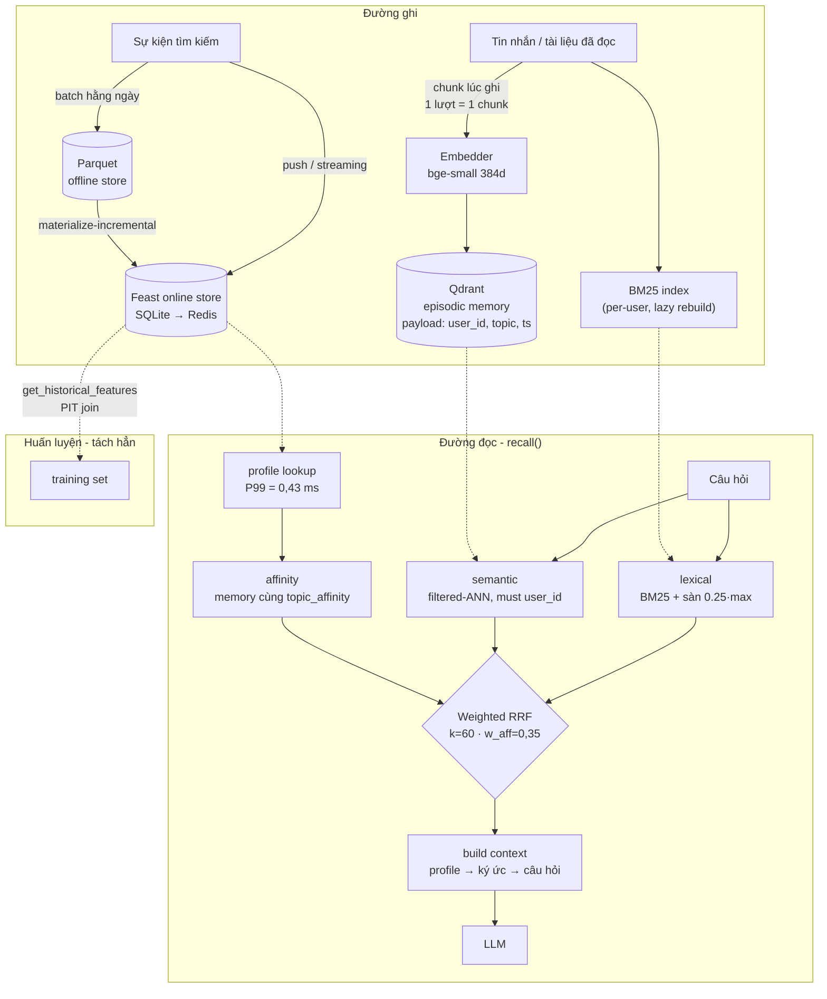

# Hybrid Memory - kiến trúc trí nhớ cho trợ lý AI tiếng Việt

**Tác giả:** Nguyễn Phú Cường · Day 19 Track 2 · bonus challenge

Trợ lý cần nhớ ba thứ có nhịp ghi khác nhau, và đó là lý do duy nhất đủ mạnh
để tách kho: ký ức từng phiên (ghi liên tục), hồ sơ ổn định (ghi hằng ngày),
nhịp hoạt động gần đây (ghi theo luồng). Gộp cả ba vào một kho thì kho nào
cũng phải chạy theo nhịp ghi dày nhất

---

## Sơ đồ

Đường đọc chỉ có **hai** lượt I/O trước khi gọi LLM: một point lookup vào Feast
và một truy vấn ANN có filter. Đó là ràng buộc thiết kế, không phải kết quả
tình cờ - mỗi hop thêm vào đây là latency mà người dùng cảm nhận được

---

## Quyết định 1 - Chunking: **mỗi lượt một chunk, khâu lại lúc đọc**

**Chọn:** một tin nhắn / một ghi chú = một điểm vector, cắt lúc **ghi**.
**Bỏ:** cắt theo cả cuộc hội thoại, và cắt theo cửa sổ token cố định

| | Chất lượng truy hồi | Chi phí lưu | Chiếm context window |
|---|---|---|---|
| mỗi lượt (chọn) | cao - vector không bị pha loãng | cao nhất, ~1 vector/lượt | thấp, chunk ngắn |
| cả cuộc hội thoại | thấp - 1 vector gánh 5 chủ đề | thấp | cao, kéo cả hội thoại vào |
| cửa sổ token cố định | trung bình | trung bình | trung bình, nhưng cắt giữa câu |

Đánh đổi thật nằm ở chỗ này: cắt mỗi lượt tốn nhiều vector nhất (~1 KB/lượt ở
384 chiều) nhưng đó là **thứ rẻ nhất trong ba thứ**. Cái đắt là context window
của LLM và là chất lượng truy hồi. Một vector gộp cả cuộc hội thoại về
Kubernetes *và* pgvector *và* JWT nằm ở trọng tâm của ba cụm - nó không gần
truy vấn nào cả

Lý do cắt lúc **ghi** chứ không lúc đọc: chỉ phía gọi mới biết một lượt kết
thúc ở đâu. Suy ra ranh giới từ văn bản đã ghép là tự tay vứt đi thông tin
mình đang có sẵn. Bù lại, chunk ngắn mất ngữ cảnh xung quanh - cách chữa là
khâu lại lúc đọc (kéo thêm lượt liền trước/sau của cùng phiên), chưa làm trong
POC này và nằm ở phần hạn chế bên dưới

## Quyết định 2 - Feature schema: **bảng phẳng, không phải embedding feature**

| feature | entity | nguồn | TTL | nhịp ghi |
|---|---|---|---|---|
| `topic_affinity` | user | batch từ log tìm kiếm | 30 ngày | hằng ngày |
| `preferred_language` | user | batch | 30 ngày | hằng ngày |
| `reading_speed_wpm` | user | batch | 30 ngày | hằng ngày |
| `queries_last_hour` | user | streaming | **1 giờ** | liên tục |
| `distinct_topics_24h` | user | streaming | **1 giờ** | liên tục |

**Chọn:** feature dạng bảng, giá trị đọc được bằng mắt.
**Bỏ:** một `user_embedding` 384 chiều học từ lịch sử (embedding feature)

Embedding feature mạnh hơn về sức biểu diễn - nó bắt được "người này thích bài
thiên về thực hành hơn lý thuyết", thứ mà `topic_affinity="cloud"` không diễn
tả nổi. Nhưng nó trả giá ba chỗ: (1) không debug được - khi trợ lý gợi ý sai,
không ai nhìn 384 số mà biết vì sao; (2) phải huấn luyện lại và **backfill**
mỗi lần đổi kiến trúc encoder, trong khi cột `topic_affinity` chỉ là một câu
`GROUP BY`; (3) không giải thích được cho người dùng, mà Nghị định 13/2023
yêu cầu chủ thể dữ liệu được biết dữ liệu cá nhân của mình bị xử lý thế nào.
Với một POC, khả năng giải thích thắng sức biểu diễn

TTL là chỗ hai họ feature tách hẳn nhau. `queries_last_hour` để TTL 30 ngày
thì trả lời câu "dạo này tôi tập trung vào gì" bằng dữ liệu tháng trước - sai
mà không hề báo lỗi. Ngược lại `topic_affinity` TTL 1 giờ thì cứ vài phút lại
rỗng, và trợ lý mất khả năng cá nhân hoá mỗi khi batch chưa kịp chạy. **TTL
phải bằng thời gian mà feature còn đúng, không phải bằng chu kỳ ghi**

## Quyết định 3 - Freshness: **ba mức, chọn theo cái giá của việc trả lời cũ**

| Ca dùng | Độ trễ chấp nhận | Cơ chế | Vì sao |
|---|---|---|---|
| "tôi vừa đọc gì xong?" | **dưới 1 giây** | ghi thẳng vào Qdrant trong `remember()` | người dùng vừa tự tay làm việc đó; không thấy nó là hỏng |
| "dạo này tôi tập trung vào gì?" | **~5 phút** | Feast Push API / micro-batch | đếm gộp theo giờ, lệch 5 phút không đổi kết luận |
| "gợi ý đọc tiếp" | **hằng ngày** | `materialize-incremental` | affinity là xu hướng nhiều tuần; cập nhật theo phút chỉ thêm nhiễu |

Nguyên tắc rút ra: độ tươi cần thiết tỉ lệ với **cái giá của một câu trả lời
cũ**, không tỉ lệ với việc dữ liệu thay đổi nhanh đến đâu. `topic_affinity`
đổi hằng ngày nhưng câu trả lời cũ của nó vô hại; `queries_last_hour` cũng đổi
hằng ngày nhưng câu trả lời cũ của nó khiến trợ lý nói sai về hiện tại

## Phương án đã cân nhắc rồi **bỏ**

**Bỏ:** đưa ký ức từng phiên vào feature store dưới dạng embedding feature
view, để chỉ còn một kho duy nhất

Nghe hấp dẫn: một registry, một đường materialize, một mô hình quyền. Bỏ vì
**nhịp ghi lệch nhau hai bậc độ lớn**. Ký ức sinh ra mỗi lượt trò chuyện và
phải tìm được ngay lập tức; hồ sơ đổi mỗi ngày. Feature store tối ưu cho *point
lookup theo khoá* - NB4 đo được P99 = 0,43 ms - chứ không phải cho tìm kiếm
xấp xỉ theo độ tương tự; nó không có HNSW, không có filtered-ANN, không có
over-fetch. Bắt nó phục vụ truy hồi ngữ nghĩa là dùng sai công cụ, rồi sẽ phải
tự viết lại ANN bên trên nó

**Bỏ:** cách ly người dùng bằng post-filter (lấy top-K toàn cục rồi loại theo
`user_id`). NB5 đã đo: khi filter còn chọn ~3,8% corpus, recall của post-filter
tụt về **0,00** trong khi filtered-ANN giữ **1,00**. Filter theo một người dùng
trên index dùng chung còn chọn lọc hơn thế nhiều. `demo.py` khẳng định điều này
bằng `assert`, không phải bằng lời: ký ức của `u_042` không bao giờ lọt vào
context của `u_001`

## Bối cảnh tiếng Việt

- **Tách từ.** POC tách theo khoảng trắng (giữ dấu). Tiếng Việt là ngôn ngữ
  âm tiết: "cơ sở dữ liệu" thành ba token rời, nên BM25 khớp nhầm mọi tài liệu
  có chữ "dữ liệu". `pyvi`/`underthesea` gộp được từ ghép và nâng độ chính xác
  lexical, nhưng thêm ~200 MB phụ thuộc và một mô hình tách từ phải bảo trì -
  và chúng **vỡ** đúng ở chỗ người Việt trộn tiếng Anh ("deploy con service
  này"). POC chấp nhận cái giá đó và bù bằng RRF: khi nhánh lexical nhiễu,
  nhánh vector vẫn kéo kết quả đúng lên. Chi tiết thấy được ở cột provenance
  trong output - nhiều dòng gắn nhãn `lex` chỉ vì trùng "đọc"/"về", nên
  `LEX_FLOOR = 0.25` cắt bớt phần nhiễu đó
- **Trộn mã vi/en.** NB2 đã đo trên chính corpus này: với truy vấn diễn đạt
  lại bằng tiếng Việt, semantic đạt Precision@10 **24,0%** còn BM25 đạt
  **33,3%**. Mô hình English-first thua ngay trên sân nhà tiếng Việt - đó là
  lý do lai BM25 chứ không phải để "cho chắc". Lên production thì đổi
  `EMBEDDING_BACKEND=bge-m3` (1024 chiều, đa ngữ) và index lại
- **Riêng tư.** Nghị định 13/2023/NĐ-CP coi lịch sử trò chuyện là dữ liệu cá
  nhân. `user_id` trong payload là ranh giới cách ly *và* là đơn vị để xoá:
  yêu cầu "xoá dữ liệu của tôi" trở thành một `delete` theo filter, không phải
  một cuộc rà soát toàn index

---

## Vibe-coding log

Làm cá nhân, dùng AI assistant trong terminal

**Prompt hiệu quả nhất** - "đừng tối ưu vội, phân rã ngân sách latency theo
tầng trước đã"

Khi NB3 báo P99 = 80,8 ms, phản xạ của cả tôi lẫn AI là hạ
`depth` của RRF. Bảng phân rã cho thấy BM25 + ANN chưa tới 5% ngân sách - hạ
depth sẽ giảm chất lượng fusion mà không giảm latency. Đo trước khi sửa đã
chặn đúng một thay đổi sai

**Prompt fail** - "vậy kết luận là gì?" 

AI đáp "CPU máy này chậm, chấp nhận
thôi", và tôi tin vì nó khớp mọi dữ liệu đang có. Vẫn sai. Prompt cứu vãn hỏi
tính hợp lý chứ không hỏi kết luận: "46 ms cho bge-small ở 18 token là vô lý -
giả định nào đang sai?" Bisect ra hồi quy ~10× ở `onnxruntime` 1.29.0

